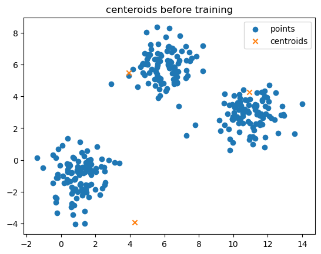
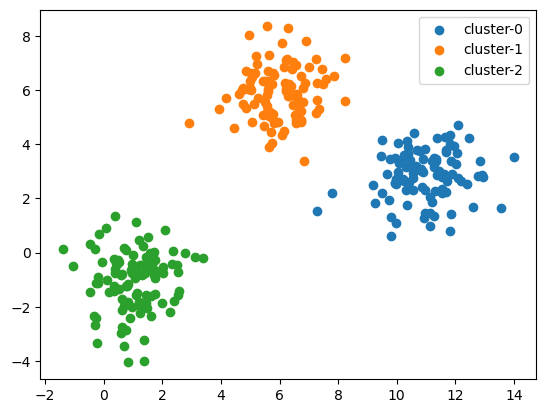

# KMeans Clustering Implementation

This repository contains a custom implementation of the KMeans clustering algorithm in Python, designed from scratch. It supports both direct and incremental approaches for updating centroids during the training process.

# Visualization Examples

This document showcases examples of centroids before and after training with `k=3` using our custom KMeans clustering implementation.

## Centroids Before Training



## Centroids After Training



## Features

- **Customizable Clustering**: Set the number of clusters (`k`) and control the centroid initialization.
- **Flexible Updating Strategy**: Choose between `direct` and `incremental` centroid updating methods.
- **Visualization**: Generate plots before and after training to visualize the clustering results (for 2D datasets).

## Dependencies

This project relies on the following Python libraries:

- **NumPy**: For efficient numerical computations. 
- **Matplotlib**: For creating visualizations of the clustering.

### Installing Dependencies

To install these dependencies, you can use `pip`, Python's package installer. Run the following command in your terminal:

```bash
pip install numpy matplotlib
```

## Usage

To use this KMeans implementation, simply import the `KMeans` class from `kmeans.py` and initialize it with your dataset. Here's a quick example:

```python
from kmeans import KMeans

# Your dataset
points = [...]  # Add your data points here

# Initialize KMeans
kmeans = KMeans(pts=points, k=3, algo="direct")

# Train
kmeans.train()

# Plot the results
kmeans.plot()
```

## License

This project is licensed under the MIT License - see the [LICENSE](LICENSE) file for details.